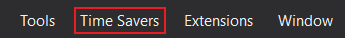
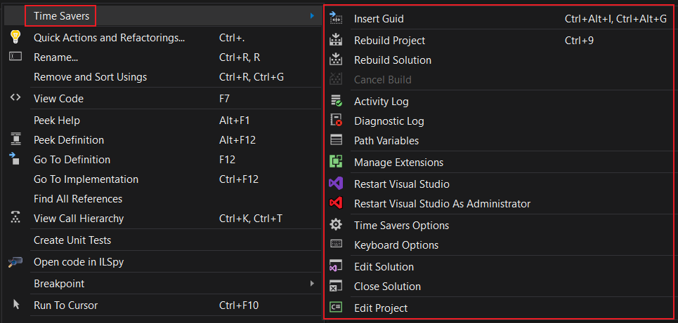

![Version][version-badge-url]
[![License][license-badge]](https://github.com/luminous-software/extensibility-logs/blob/master/LICENSE)
[![Donate][paypal-badge]](https://www.paypal.me/yannduran/5)

[version-badge-url]: http://vsmarketplacebadge.apphb.com/version-short/YannDuran.VisualStudioTimeSavers.svg?label=version&colorB=7E57C2
[license-badge]: https://img.shields.io/badge/license-MIT-7E57C2.svg?style=flat-square
[license-url]: https://github.com/luminous-software/extensibility-logs/blob/master/LICENSE
[paypal-badge]: https://img.shields.io/badge/donate-paypal-green.svg

You can download this extension [from the Visual Studio Marketplace][marketplace-url]

[marketplace-url]: https://marketplace.visualstudio.com/items?itemName=YannDuran.VisualStudioTimeSavers

---

## Enhance Your Productivity

Every feature of *Time Savers* was created specifically to enhance development productivity by
**saving you time**.

### Toolbar

For those people who prefer their commands front-and-center, available all all times with a single click,
this extension adds a new toolbar to hold _Time Savers_' commands.

### Menu

For those people who don't want to add yet another toolbar, this extension also adds a new top-level _Time Savers_ menu.

#### VS 2019's New Extensions Menu

>  Visual Studio has forced all extensions that add a top-level menu into a new menu called _Extensions_.
>  
>  If you don't like this new behavior,
>  you can install an extension called [**Extensions in Main Menu**][extensions-in-main-menu-url],
>  which will restore the VS 2017 behavior.
>
>  

[extensions-in-main-menu-url]: https://marketplace.visualstudio.com/items?itemName=Evgeny.RestoreExtensions

### Context Menus

For people who hate having to move their mouse from the code they're working on,
another menu has been added to the context menu of any code window, as well as to some nodes in *Solution Explorer*.
Most *Time Savers* features are available via this context menu for a simple
**right-click experience**, without having to your mouse from the code you're working on.

The commands have been grouped into their own *Time Savers* menu because most context menus
are already pretty clogged up. And they're growing all the time,
as Microsoft or 3rd-party extensions add more and more commands to them.

Unfortunately that means that there's one more click involved than I'd ideally prefer.
However I've found it much easier to find commands in a dedicated menu anyway, rather
than having to search through one gigantic menu of commands.

### Shortcuts

Some of the *Time Savers* features that tend to be used frequently have also been assigned a keyboard shortcut for a
**one or two keystroke experience**.
And of course you can add your own keyboard shortcut to any of the *Time Savers* features.

## More Information

You can read more about _Time Savers_ on its website:

[Overview][website-url] **|** [Getting Started][getting-started-url] **|** [Features][features-url] **|** [Changelog][changelog-url] **|** [Roadmap][roadmap-url]

[website-url]: https://luminous-software.solutions/time-savers
[getting-started-url]: https://luminous-software.solutions/time-savers/getting-started
[features-url]: https://luminous-software.solutions/time-savers/features
[changelog-url]: https://luminous-software.solutions/time-savers/changelog
[roadmap-url]: https://luminous-software.solutions/time-savers/roadmap

## Support the Project

If *Time Savers* has saved you time, please come back and show your support:

- you could [***rate *Time Savers****][rate-or-review-url] (only takes a couple of seconds)
- or [***review *Time Savers****][rate-or-review-url] (help others benefit from your experience)
- or [***shout me a coke***](https://www.paypal.me/yannduran/5) (as I don't drink coffee or beer lol)

[rate-or-review-url]: https://marketplace.visualstudio.com/vsgallery/049c7ac5-ba44-4a72-b4ee-7be7fb1b0edd#review-details
[qna-url]: https://marketplace.visualstudio.com/vsgallery/049c7ac5-ba44-4a72-b4ee-7be7fb1b0edd#qna
[suggestions-url]: https://marketplace.visualstudio.com/vsgallery/049c7ac5-ba44-4a72-b4ee-7be7fb1b0edd#qna
